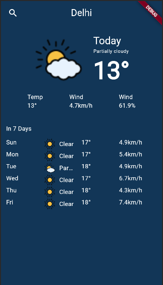
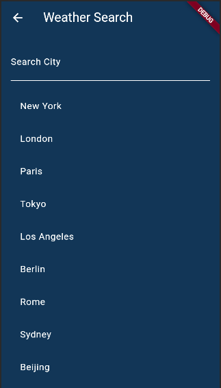

# Weather Forcast App

> A Flutter project to show 5 days weather forcast.

## Features

- **Weather:** Five Day Weather Forcast.
- **Search:** Search Weather of different city.
- **Error Handling:** Implement error alerts for connection issues or failures.

## Installation

To use this project, follow these steps:

1. Clone this repository.
2. In root directry create `.env` file and add your `API_KEY`
3. Run `flutter pub get` in your terminal to fetch the dependencies.
4. Run `flutter run` to launch the application.

### Packages Used

This project utilizes theollowing packages:

- `dio: ^5.4.0`
- `flutter_dotenv: ^5.1.0`
- `flutter_riverpod: ^2.4.9`
- `go_router: ^13.0.1`

## Folder Structure

weather_forcast_app/
|-- lib/
| |-- application/
| | |-- providers/
| | | |-- weather_provider.dart
| | |-- service/
| | | |-- weather_service.dart
| | |-- models/
| | |-- weather.dart
| |-- core/
| | |-- repository/
| | |-- weather_repository.dart
| |-- presentation/
| | |-- screens/
| | |-- home_screen.dart
| |-- main.dart

## Screenshots

<table>
  <tr>
    <td style="text-align: center;">
      
      
Light Mode

    </td>
    <td style="text-align: center;">
      
      
Dark Mode

    </td>
  </tr>
</table>

## Contributing

